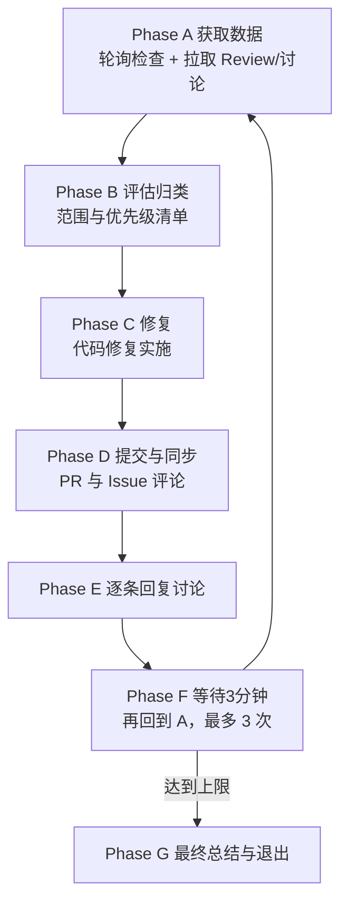

## Usage

`/pr-fix-pilot <PR_NUMBER|PR_URL>`

### Prerequisites

- 已安装并登录 GitHub CLI：`gh auth status` 正常
- 当前工作目录为目标仓库根目录
- 本地分支可推送到远端（具备权限），或已 fork 并配置 upstream/ origin

## Context

- 该 Pilot 面向"已有 PR 的修复与收敛"，遵循 A→G 闭环。
- 使用 GH CLI 拉取 PR 检查状态、Review、评论与讨论线程，分类评估后决定修复范围；若有纳入项，则进行代码修复；
  完成后自动提交并在 PR 与关联 Issue 进行同步说明；等待服务器侧自动 Review，再次循环最多 3 次，最终输出总结与结论。

---

## Phase A: 获取数据（GH CLI 轮询 + 拉取上下文）

1. 解析输入

- 接受 `<PR_NUMBER>` 或 `<PR_URL>`；解析出 `owner/repo`、`pr_number`。
- 从 PR URL 或当前仓库 `git remote get-url origin` 推断。

2. 轮询检查状态

- 使用 `gh pr view <pr> --json statusCheckRollup,commits,headRefName,baseRefName,mergeable,reviewDecision,url,author,title,number` 查询检查概况与分支信息。
- 若 `statusCheckRollup` 中存在 `IN_PROGRESS`/`PENDING` 等正在运行项：
  - 若累计等待时间未超过 30 分钟：sleep 180 秒，然后再次查询。
  - 若超过 30 分钟最长等待时长：进入后续步骤，但在 B 阶段计入风险与范围决策（例如“CI 长时间未通过”）。
- 若全部完成（成功或失败），继续。

3. 拉取评审与讨论数据

- 使用 `gh pr view <pr> --json reviews,comments,reviewThreads,reviewRequests,reviewDecision,labels,changedFiles,additions,deletions`。
- 同时抓取最后一次提交的 SHA：`gh pr view <pr> --json commits --jq '.commits[-1].oid'`。
- 收集数据用于后续分类、去重与决策。

4. 快照保存（可选）

- 保存到 `./.claude/pr-fix/pr-<number>/00-pr-snapshot.md`（或 `.json`），包含关键信息与原始统计摘要。

---

## Phase B: 评估归类问题并做出“范围与优先级”决策

目标：对所有 Review/评论/讨论建议进行“对错判断 + 价值评估与范围平衡”，产出一份可执行的“修复范围与优先级清单”。

1. 分类与清洗

- 分类标签：
  - 阻断问题（Blocking）：必须修复才能合并；通常来自 Request Changes、编译/测试失败、安全问题、严重逻辑错误。
  - 高收益非阻断（High ROI, Non-blocking）：改动小、风险低、收益明显的改进项。
  - 一般优化（Nice-to-have）：可优化但非当下必须，或投入产出一般。
  - 已拒绝/争议项（Rejected/Contested）：已说明“不同意/不采纳/无效”的内容，或存在明显误解。
- 清洗规则：
  - 去除已解决/已标记 resolved 的线程。
  - 合并重复与等价建议（同一文件与行、同义建议、相同症结）。
  - 过滤与当前 PR 范围无关或已偏离版本边界的建议。

2. 投入与收益估算（每项）

- 指标建议：
  - 实现复杂度（1-5）
  - 风险与回归成本（1-5）
  - 变更面大小（1-5）
  - 用户/业务价值（1-5）
- 计算建议：
  - 设“工作量”= 复杂度 + 变更面（或加入风险权重）
  - 设“收益值”= 用户价值 - 风险（或加入稳定性权重）
  - 用简单矩阵排序：优先“低成本高收益”。

    2.5) 并行生成候选方案

- 每条建议包含：变更点列表、影响面、风险点与测试建议、预估工作量/风险分、预期收益。
- 将结果并入 `./.claude/pr-fix/pr-<number>/01-evaluation.md`，用于排序与取舍。

3. 修复范围决策（含取舍理由）

- 必选：全部阻断问题（前提是判断正确且不与其他规则冲突）。
- 可选：纳入“高收益且低风险/低成本”的非阻断项（需要给出纳入理由）。
- 拒绝（含延后）：对中低收益或高风险项，记录为拒绝并说明理由与后续安排（将在 PR 评论中同步）。

4. 产出清单并同步到 PR

- 生成“修复范围与优先级清单”，字段建议：
  - 分类（Blocking/High ROI/Nice-to-have/Rejected）
  - 摘要与定位（文件/行/上下文）
  - 预估工作量与风险说明
  - 预期收益与影响面
  - 取舍结论与理由
- 在进入 C 之前，将清单与取舍理由以评论同步到 PR。
- 保存为 `./.claude/pr-fix/pr-<number>/02-fix-scope.md`。

---

## Phase C: 修复（如有纳入项）

条件：若 B 阶段"纳入项"非空。

执行：根据清单逐项实现修复

Instructions:

1. 按优先级从高到低逐项实现；每个逻辑单元使用独立 commit；
2. 若为阻断问题，优先修复并补充必要的测试；
3. 保持代码风格与现有约定一致；避免无关重构；
4. 对"拒绝（含延后）"的建议不做修改，但记录理由；
5. 实施完成后返回"变更摘要 + commit 列表（sha, message）"。

若无纳入项：跳过实施，转 D。

---

## Phase D: 提交与同步（代码、PR、Issue）

1. 提交与推送

- 若 C 已修改：
  - `git add -A && git commit -m "fix(pr #<number>): <summary>\n\nRefs: <pr-url>"`
  - `git push origin HEAD`（或推送到 PR 的 head 分支）
- 收集有效 commit SHA 列表，保存到 `./.claude/pr-fix/pr-<number>/03-commits.md`。

-2) PR 评论同步

- 汇总：已修复项、拒绝项（含延后）；每类列出摘要、定位、理由、关联 commit。
- 使用 `gh pr comment <number> --body-file <generated.md>`。

3. 关联 Issue 评论（可选）

- 自动解析关联 Issue：
  - 优先 `gh pr view <pr> --json closingIssuesReferences`；
  - 若无，则扫描 PR 正文与 commit message 中的 `#<id>` 引用。
- 对识别到的 Issue 使用 `gh issue comment <id> --body-file <generated.md>` 汇报修复摘要与 commit 关联（可关闭条件遵循项目策略）。

4. 检查本地未提交改动并补交

- 执行 `git status --porcelain` 检查是否仍有未提交变动；
- 若存在：与第 1 步相同流程进行补交（`git add -A && git commit ... && git push`），并更新 `03-commits.md`；
- 若不存在：继续后续阶段。

---

## Phase E: Discussion 逐条回复

目标：对仍开放的讨论给予明确回复：讨论线程逐条单独回复；对非线程的 review 总结类评论，允许集中一条分点回复。标签：已修复 / 拒绝 / 澄清（不设“延后”，延后视为拒绝并说明理由）。

执行建议：

- 对于 GitHub Review Threads（讨论贴）：在线程内逐条单独回复，引用关键上下文，附上 commit 链接和文件行。
- 对于非线程的 Review 总结类评论（一次列出多个问题）：允许集中一条回复，按小节分点回应并引用相关上下文。
- 工具：
  - 简单情况可在 PR 评论中集中或逐条引用并回复；
  - 更精确的逐条回复可借助 `gh api`（GraphQL `addPullRequestReviewComment` / `addPullRequestReviewThreadReply`）。
- 模板要点：
  - 开头标签：【已修复】/【拒绝】/【澄清】（不设“延后”；如为延后请使用【拒绝】并说明原因与后续安排）
  - 简述处理方式与理由；必要时给出代码片段/链接。
- 保存到 `./.claude/pr-fix/pr-<number>/04-discussion-replies.md` 以备审计。

---

## Phase F: 等待服务器自动 Review 并回到 A（至多 3 次）

- 完成 D/E 后，sleep 180 秒。
- 重新执行 Phase A（拉取最新检查状态与讨论）；
- 若检查失败或出现新的阻断/高优先项，则重复 B→E；
- 循环次数达到 3 次后进入 G。

---

## Phase G: 总结与退出

输出“最终汇总与结论”：

- 检查最终状态：成功/失败/仍有阻断
- 已修复项清单与关联 commit（短 SHA）
- 拒绝项及理由与后续建议
- 讨论回复概览（数量与覆盖率）
- 合并建议（可合并/需复审/待外部依赖）

保存为 `./.claude/pr-fix/pr-<number>/05-final-summary.md`，并在 PR 追加终报告评论。

---

## Execution Flow Summary



---

## Output Structure

所有输出保存到 `./.claude/pr-fix/pr-<number>/`：

```
00-pr-snapshot.md      # PR 基本信息与检查概览
01-evaluation.md       # 评审项聚合、分类、估算
02-fix-scope.md        # 修复范围与优先级清单（提交前已在 PR 评论）
03-commits.md          # 提交与推送摘要（sha, message）
04-discussion-replies.md # 逐条回复草稿与回执
05-final-summary.md     # 最终汇总与结论（并在 PR 评论）
```

---

## Success Criteria

- 阻断问题均已修复或获得明确、充分的拒绝理由并经沟通达成一致；
- 高收益非阻断项在可控成本内纳入；
- CI/自动检查通过或已按流程豁免；
- PR 与关联 Issue 均获得清晰、可追溯的记录与链接；
- 最终总结完整，便于合并决策与后续追踪。

---

## Important Notes

- 遵循“最小可合并单元”原则，避免范围膨胀；
- Commit 粒度与信息需清晰、可审计；
- 对“拒绝（含延后）”类项务必写明充分理由并在 PR 同步；
